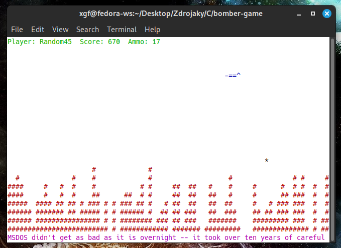

# Bomber Game

A terminal-based bombing game written in C using ncurses. Control a plane that drops bombs to destroy the city below!

*Tested on Fedora 42 Cinnamon*



## Features
- **Dynamic bomber movement** - Zig-zag pattern with automatic direction flipping
- **Destructible terrain** - Buildings are destroyed block by block
- **Two attack modes**:
  - **Bombs** (3x3 area damage)
  - **Machine gun** (5-block piercing shot, limited ammo)
- **Scoring system**:
  - 10 points per block destroyed by bombs
  - 5 points per block destroyed by machine gun
- **High score tracking** - Scores saved to `bomber.scores` file
- **Visual effects**:
  - Colored gameplay (if terminal supports it)
  - Smooth animations
  - Scrolling fortune messages at bottom
- **Game states**:
  - Pause screen (P key)
  - Help screen (H key)
  - Win/loss conditions

## Installation & Running
### Dependencies
- Unix-like OS (Linux, macOS, FreeBSD)
- `ncurses` library  
  Install with: 
  - Fedora: `sudo dnf install ncurses-devel`
  - Ubuntu/Debian: `sudo apt install libncurses-dev`
  - macOS: `brew install ncurses`
- `fortune` (for random messages) - Usually preinstalled

### Compile & Run
```bash
make
./bomber
```
## How to Play
### Controls
- `Down Arrow` - Drop bomb (3x3 explosion)
- `Space` - Fire machine gun (5-block piercing shot)
- `P` - Pause game
- `H` - Show help screen
- `Q` - Quit game

### Game Rules
- **Objective**: Destroy all city blocks (`#`)
- **Movement**:
  - Bomber moves automatically left/right
  - Changes direction at screen edges
  - Descends after each direction change
- **Attacks**:
  - Bombs can only be dropped when at safe altitude
  - Machine gun has limited ammo (17 shots)
- **Lose conditions**:
  - Crashing into buildings
  - Getting too low

## Customization
You can modify these in `bomber.h`:
```c
#define DAMAGE_RADIUS 3    // Bomb explosion size
#define MAX_AMMO 17       // Machine gun ammo capacity
#define SAFE_BOMB_HEIGHT 5 // Minimum safe bombing altitude
```

Or adjust timing in `bomber.c`:
```c
struct timespec ts_frame = { .tv_sec = 0, .tv_nsec = 60000000L }; // Game speed
struct timespec ts_bomb = { .tv_sec = 0, .tv_nsec = 20000000L };   // Bomb speed
```

## Scoring
- Scores are saved automatically
- Top 10 scores are displayed in the menu
- Score file location: `bomber.scores` in working directory

## Known Issues
- Requires terminal with UTF-8 support for proper rendering
- Color display depends on terminal capabilities
- High score file may need manual deletion if corrupted

## License
MIT License - See [LICENSE](LICENSE) for details.
